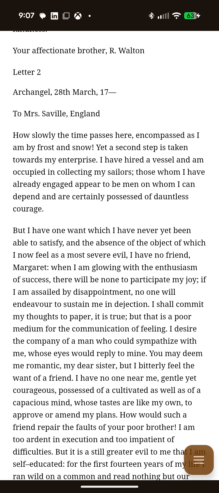
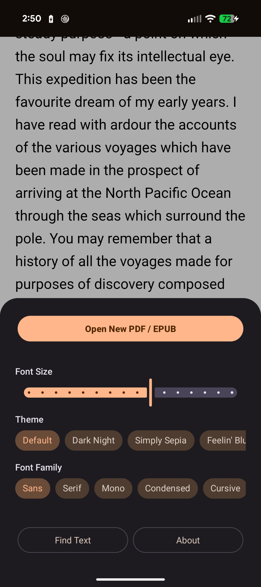
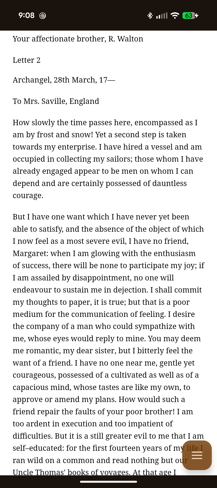
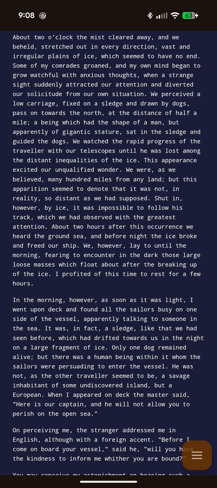

# Stuart
Text-only PDF and EPUB scraper / reader app for Android

### Features
- Open PDF and EPUB files as plain text
- Easily find text with search tool
- Change font / theme / text size
- Easily read documents on mobile devices
- Share PDF/Epub files via share sheet to app for fast viewing

### Download
If you're looking for a pre-compiled binary of the app, you can find it over at <a href="https://play.google.com/store/apps/details?id=org.johnspahr.stuart" target="_blank"><b>Google Play</b></a>!
<i>Still rolling out at time of writing–if it's not available in your region yet, it will be shortly :)</i>

### Screenshots

### Libraries
- Jsoup - https://jsoup.org
- PDFBox - https://github.com/tomroush/pdfbox-android
- Epublib - https://github.com/positiondev/epublib
